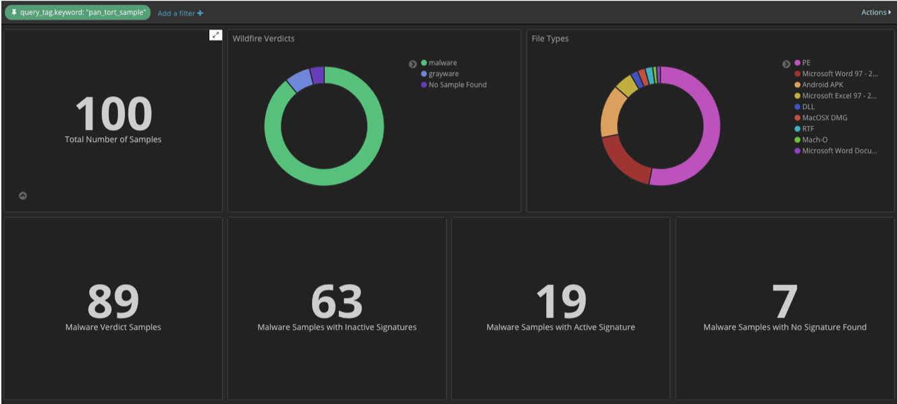

Interpreting the Results
========================

The purpose of pan-tort is to add context to the output for misses during a security test.
Similar interpretations can be used for any type of data fed into pan-tort.

For this example we will use the sample data and Kibana dashboard view.

Sample and Verdict counts
-------------------------

The first level of data is samples found and file verdicts. This gives an indication of
what files may or may not have signature coverage.

In the dashboard there are 100 total samples.

The verdicts in the pie chart include:

    * 89 malware
    * 7 grayware
    * 4 sample not found

The malware count of 89 is displayed under the total sample count.

At this stage the 11 non-malware sample misses can be accounted for.

Non-malware samples found
~~~~~~~~~~~~~~~~~~~~~~~~~

For non malware or phishing verdict of benign and grayware, signatures are not typically available.

Therefore, any grayware or benign verdict samples are expected to be part of a test miss.

No sample found
~~~~~~~~~~~~~~~

In some cases a hash sample lookup will return no results. This means that the sample doesn't no exist in Autofocus.

The most likely cause for this type of response is an unsupported file type. The test environment may include file types
that are not captured and analyzed by Wildfire.

Malware Signature status
------------------------

For sample with a malware or phishing verdict, signatures are typically created and mapped to the hash sample.

The second row of the dashboard shows a breakdown of signature status for the 89 malware samples.

    * 63 inactive signatures
    * 19 active signatures
    * 7 no signature

Inactive signatures
~~~~~~~~~~~~~~~~~~~

In real world deployments, signatures are rotated in the system thus aging out and being replaced by newer malware
threats.

This results in a set of signatures that have been created and were released in the past but are now dormant.
These are the inactive signatures.

If the test environment is using outdated samples not representative of real world threat activities, there is a
high probability that these signatures have been pulled and no longer active. This is a common occurrence.

Active signatures
~~~~~~~~~~~~~~~~~

A miss for active signatures may indicate an update is needed to the signature associated to the file sample.

These can require working with the POC or TAC teams to capture the hash and threatname values to validate
the active state and validity of the signature.

No signature
~~~~~~~~~~~~

Not all malware verdict samples will have an associated signature. A variety of factors including false positive
concerns may lead to a signature not being created.

Misses here can be discussed with TAC and PM teams to determine why a signature may not exist for the sample.

