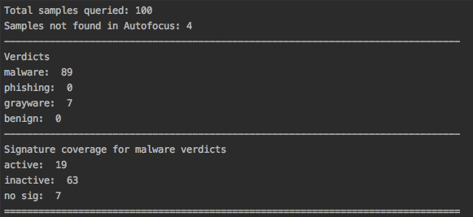
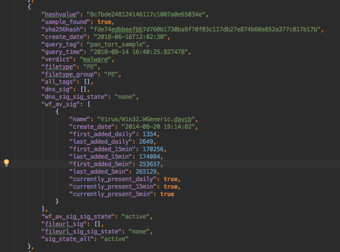

Using pan-tort
==============

The prior installation steps ensure pan-tort is ready to run and can communicate with Autofocus.

Running a query
---------------

To run a query with the existing hash list, run hash_data_plus.py. You will be prompted for a
name to use for this query. This name is used to filter results in Kibana and to append to
the json output files for easy reference.

::

    $ python hash_data_plus.py
    Enter brief tag name for this data: some tag for this query

At this point pan-tort will run in 2 stages:

    * Initial Autofocus sample search to get verdict, file type, and malware data

    * Per-hash signature coverage search for each hash found in Autofocus

The intial sample search will send up to 1,000 samples per query and capture responses.
This search should only take 1-2 minutes for smaller hash list sizes.

Signature coverage queries are 1 sample per lookup and take approximately 3-8 seconds based
on response time.

A 100 sample run can take from 5-10 minutes on average.

Viewing the results
-------------------

Summary Stats
~~~~~~~~~~~~~

If running from a terminal console, at the end of the run, a short summary of key stats is shown.

Values in the summary stats:

    * Total samples queried: the number of hashes in the input list

    * Samples not found in Autofocus: the hash value is not found in Autofocus

    * Verdicts: based on Wildfire analysis verdict results

    * Signature coverage for malware verdicts

        + active: There is a WF/AV sig currently loaded in the firewall

        + inactive: A signature has been created and is not currently loaded in the firewall

        + no sig: no signature history for this file sample

Kibana dashboard
~~~~~~~~~~~~~~~~

The Kibana dashboard provides a more interactive view of the output data.

Pan-tort includes importable json elements for Kibana. Users can then extend visualizations and dashboard
as desired using the same source data.

.. image:: images/dashboard.png

Text json output
~~~~~~~~~~~~~~~~

For quick analysis or sharing, there is a pretty-format json file with all results data. This detailed data extends
beyond the summary stats to include malware family and groups, file types for each sample, and signature details
such as threatname, DNS domains, and create dates.

